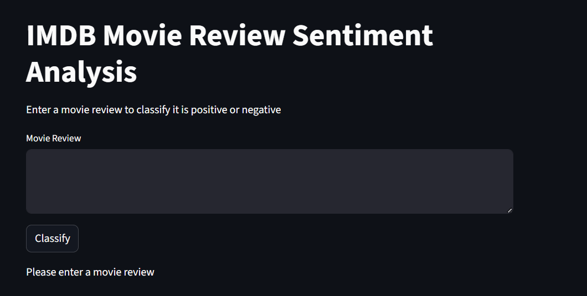
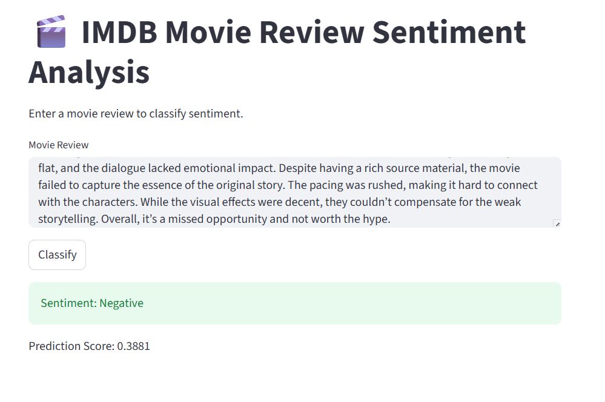
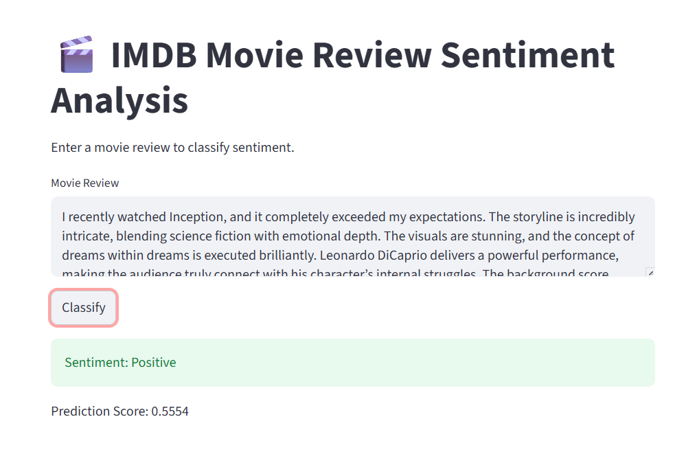

**Simple RNN Implementation (Deep Learning for Sequential Data)**

This project demonstrates the implementation of a Simple Recurrent Neural Network (Simple RNN) for handling sequential or time-dependent data.

Unlike traditional neural networks, a Simple RNN is designed to process data step-by-step while retaining information from previous inputs, making it suitable for tasks where order and sequence matter.

Information is passed from one step to the next

The model learns patterns in sequences over time

In frameworks like Keras, a Simple RNN layer feeds its output back into itself, allowing it to maintain a form of memory across timesteps

## Features

- Implementation of Simple RNN model

- Handles sequential and time-series data
  
- Demonstrates training and prediction workflow

-Model evaluation and performance tracking
 
- Learns temporal patterns from data

  

## Tech Stack
Python
TensorFlow / Keras
NumPy
Pandas
Matplotlib

## Screenshot

## How It Works
-Load and preprocess sequential data

-Convert data into time-step sequences

-Build a Simple RNN model

-Train the model on sequence data

-Evaluate performance

-Generate predictions

🔥Novelty of the Project

Focuses on fundamental RNN architecture

Provides a clear understanding of sequence learning basics

Serves as a stepping stone to advanced models like LSTM and GRU

Demonstrates how memory is handled in neural networks

## Conclusion

This project provides a foundational understanding of how Simple RNNs work and how they can be applied to sequential data problems. It highlights the importance of memory and time dependency in deep learning models.
